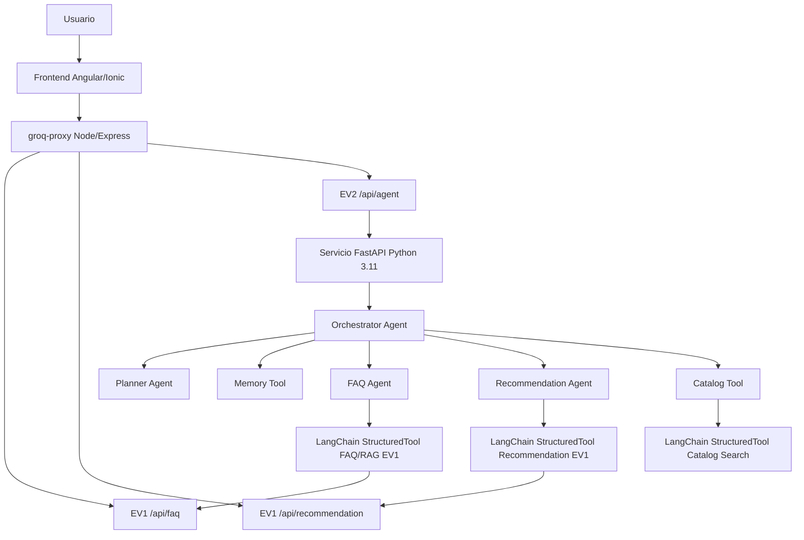

# Arquitectura EV2 - Capa de Agentes GM-COMPONENTS

## 1. Objetivo de la arquitectura

La EV2 agrega una capa de agentes sobre la solucion EV1 de GM-COMPONENTS.

La EV1 mantiene las capacidades principales del proyecto:

- FAQ con RAG.
- Recomendacion conversacional.
- Consumo de catalogo real.
- Integracion con Groq, Voyage AI y MongoDB para logs.

La EV2 no reemplaza ni reimplementa esos modulos. La arquitectura nueva agrega un servicio separado en Python 3.11 que orquesta agentes y usa las capacidades de EV1 como herramientas reales mediante HTTP/API.

## 2. Vision general



## 3. Separacion entre EV1 y EV2

La EV1 corresponde al proyecto base:

- `src/`: frontend Angular/Ionic.
- `groq-proxy/`: backend Node/Express.
- `groq-proxy/rag/`: RAG FAQ.
- `groq-proxy/routes/faq.route.js`: endpoint FAQ.
- `groq-proxy/routes/recommendation.route.js`: endpoint Recommendation.
- `groq-proxy/services/faq.service.js`: logica FAQ.
- `groq-proxy/services/recommendation.service.js`: logica Recommendation.

La EV2 corresponde a la capa de agentes:

- `agente/app.py`: API FastAPI de agentes.
- `agente/main.py`: consola de agentes.
- `agente/agents/orchestrator_agent.py`: coordinador principal.
- `agente/agents/planner_agent.py`: clasificacion, planificacion y pasos.
- `agente/agents/faq_agent.py`: agente especializado en FAQ.
- `agente/agents/recommendation_agent.py`: agente especializado en recomendacion.
- `agente/tools/langchain_tool_registry.py`: registro de herramientas LangChain.
- `agente/memory/session_store.py`: memoria corta.
- `agente/memory/long_term_memory.py`: memoria larga local.

Esta separacion evita mezclar dependencias Python con EV1 y mantiene la integracion mediante HTTP.

## 4. Flujo de comunicacion

### 4.1 Flujo desde frontend

1. El usuario entra a la seccion `Agentes EV2`.
2. El frontend envia una solicitud al backend Node:

```text
POST /api/agent/chat
```

3. `groq-proxy` reenvia la solicitud al servicio Python:

```text
POST http://localhost:8790/agent/chat
```

4. FastAPI entrega el mensaje al `Orchestrator Agent`.
5. El orquestador decide el intent y llama al agente correspondiente.
6. El agente usa una herramienta LangChain para consultar EV1.
7. La respuesta vuelve al frontend con:

- respuesta final,
- intent,
- plan,
- tools usadas,
- memoria corta,
- memoria larga,
- trazabilidad tecnica.

### 4.2 Endpoints principales

EV1:

```text
GET  /api/health
POST /api/faq
POST /api/recommendation
```

EV2 por Node:

```text
GET  /api/agent/health
POST /api/agent/chat
```

EV2 directo en FastAPI:

```text
GET    /health
POST   /agent/chat
DELETE /agent/session/{session_id}
```

## 5. Agentes implementados

### 5.1 Orchestrator Agent

Archivo:

```text
agente/agents/orchestrator_agent.py
```

Responsabilidades:

- Recibir la solicitud principal.
- Recuperar memoria por `session_id`.
- Guardar el mensaje del usuario.
- Detectar comandos forzados:
  - `/faq`
  - `/rec`
- Clasificar intent mediante `detect_intent`.
- Mantener continuidad si hay una recomendacion activa.
- Construir el plan.
- Ejecutar el agente especializado.
- Guardar la respuesta en memoria.

### 5.2 Planner Agent

Archivo:

```text
agente/agents/planner_agent.py
```

Responsabilidades:

- Clasificar la intencion:
  - `faq`
  - `recommendation`
  - `catalog`
  - `general`
- Construir un plan con pasos para cada tipo de tarea.

Ejemplo para recomendacion:

```text
analizar_consulta
revisar_memoria
consultar_recomendador
redactar_respuesta
```

### 5.3 FAQ Agent

Archivo:

```text
agente/agents/faq_agent.py
```

Responsabilidades:

- Recuperar memorias largas relacionadas.
- Ejecutar la herramienta LangChain `gm_components_faq_rag_ev1`.
- Llamar indirectamente al RAG FAQ de EV1.
- Guardar un hecho en memoria larga.
- Devolver respuesta, productos, tools y trazabilidad.

### 5.4 Recommendation Agent

Archivo:

```text
agente/agents/recommendation_agent.py
```

Responsabilidades:

- Recuperar memorias largas relacionadas.
- Extraer presupuesto desde texto.
- Detectar si el usuario envio solo presupuesto.
- Reutilizar `baseRequest` si el flujo ya estaba iniciado.
- Ejecutar la herramienta LangChain `gm_components_recommendation_ev1`.
- Mantener estado de recomendacion en memoria corta.
- Guardar hechos de recomendacion en memoria larga.
- Finalizar y limpiar el flujo cuando `nextStep` es `done`.

## 6. Uso de LangChain

La EV2 usa LangChain Core como framework especifico para registrar y ejecutar herramientas del agente.

Archivo:

```text
agente/tools/langchain_tool_registry.py
```

Herramientas registradas:

```text
gm_components_faq_rag_ev1
gm_components_recommendation_ev1
gm_components_catalog_search
```

Cada herramienta se registra con `StructuredTool.from_function`.

Esto permite que los agentes EV2 usen herramientas tipadas y trazables sin cambiar la logica existente de EV1.

Ejemplo de flujo:

```text
FAQ Agent
  -> invoke_langchain_tool("gm_components_faq_rag_ev1")
  -> StructuredTool
  -> ask_ev1_faq
  -> POST /api/faq
  -> RAG FAQ EV1
```

## 7. Memoria

### 7.1 Memoria corta

Archivo:

```text
agente/memory/session_store.py
```

La memoria corta se mantiene en ejecucion mediante `SessionStore`.

Guarda:

- mensajes recientes,
- cantidad de turnos,
- estado de recomendacion,
- presupuesto,
- etapa actual,
- estado conversacional.

La recomendacion utiliza `RecommendationSession` para mantener continuidad durante flujos largos.

### 7.2 Memoria larga

Archivo:

```text
agente/memory/long_term_memory.py
```

La memoria larga persiste hechos en JSON local.

Ruta de ejecucion:

```text
agente/logs/long_term_store.json
```

Este archivo no se sube a GitHub porque contiene datos de ejecucion local.

La memoria larga guarda hechos como:

- preguntas FAQ realizadas,
- producto destacado,
- presupuesto,
- etapa de recomendacion,
- producto sugerido,
- metadata tecnica.

Tanto `FAQ Agent` como `Recommendation Agent` usan esta memoria.

## 8. Trazabilidad en frontend

La vista `Agentes EV2` muestra informacion tecnica para evidenciar el funcionamiento:

- intent detectado,
- framework usado,
- tool LangChain ejecutada,
- memoria corta,
- memoria larga,
- decision del orquestador,
- agentes ejecutados,
- tools usadas,
- plan del Planner Agent,
- productos y recomendaciones.

La memoria larga se muestra como un bloque desplegable llamado:

```text
Memoria largo plazo EV2
```

## 9. Scripts de ejecucion

La entrega incluye scripts `.bat` para facilitar la ejecucion:

```text
instalar_dependencias_ev2.bat
iniciar_proyecto_completo_ev2.bat
iniciar_consola_agentes_ev2.bat
```

El instalador prepara:

- dependencias frontend,
- dependencias Node de `groq-proxy`,
- entorno virtual Python 3.11 para `agente`.

Los scripts de inicio usan la `.venv` del modulo `agente` para no depender de paquetes Python globales.

## 10. Relacion con la rubrica

| Indicador | Cumplimiento en arquitectura |
|---|---|
| IL2.1 | Agentes funcionales, tools EV1 y LangChain StructuredTool |
| IL2.2 | Memoria corta por session_id y memoria larga persistida en JSON local |
| IL2.3 | Planner Agent, Orchestrator Agent y flujo adaptativo de recomendacion |
| IL2.4 | Documentacion tecnica y evidencias en `agente/docs` |
