# Evidencias EV2 - GM-COMPONENTS

## 1. Health de EV1

Comando:

```powershell
Invoke-RestMethod http://localhost:8787/api/health
```

Resultado esperado:

```json
{
  "ok": true,
  "service": "gmcomponentes_ia_demo_proxy"
}
```

Evidencia:

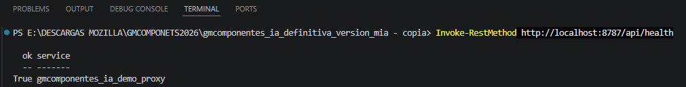

## 2. Health EV2 FastAPI

Comando:

```powershell
Invoke-RestMethod http://localhost:8790/health
```

Resultado esperado:

```json
{
  "ok": true,
  "service": "gm-components-agent",
  "python": "3.11"
}
```

Evidencia:

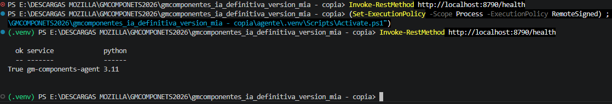

## 3. Health EV2 por Node

Comando:

```powershell
Invoke-RestMethod http://localhost:8787/api/agent/health
```

Resultado esperado:

```json
{
  "ok": true,
  "service": "gm-components-agent",
  "python": "3.11"
}
```

Evidencia:

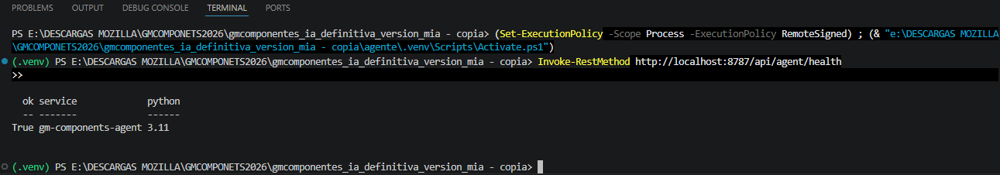

## 4. FAQ Agent con LangChain

Caso probado:

```text
tienen stock de rtx 4060
```

Resultado observado:

- El Orchestrator Agent detecta una consulta FAQ.
- El Planner Agent genera un plan de ejecucion.
- El FAQ Agent ejecuta una herramienta registrada con LangChain Core `StructuredTool`.
- La herramienta llama al endpoint `/api/faq` de EV1.
- La respuesta muestra trazabilidad, tools usadas y plan.

Evidencia:

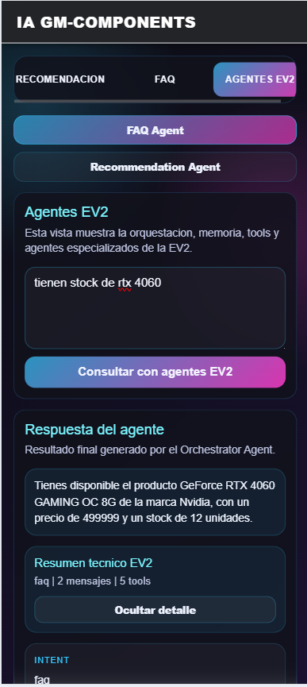
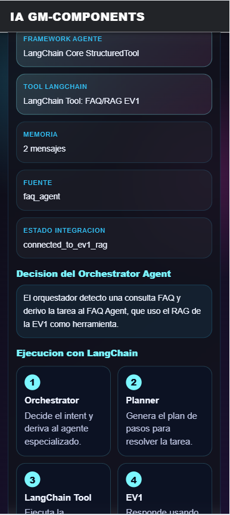

## 5. Recommendation Agent por etapas

Flujo probado:

```text
quiero una grafica
500000
Sin preferencia
Gaming
Precio
```

Resultado observado:

- El agente solicita informacion faltante por etapas.
- Mantiene continuidad mediante `session_id`.
- Conserva estado conversacional como presupuesto, etapa y preferencias.
- Ajusta su comportamiento segun las respuestas del usuario.
- Entrega producto principal y alternativas recomendadas.

Evidencia etapa intermedia:

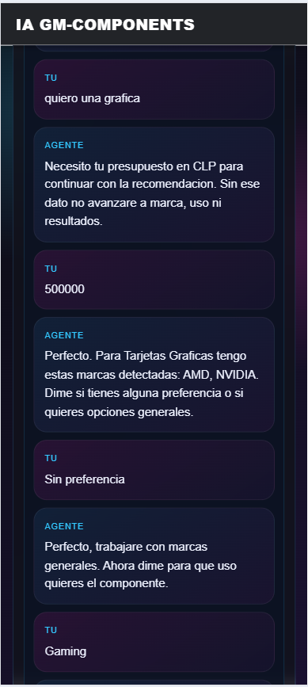

Evidencia resultado final:

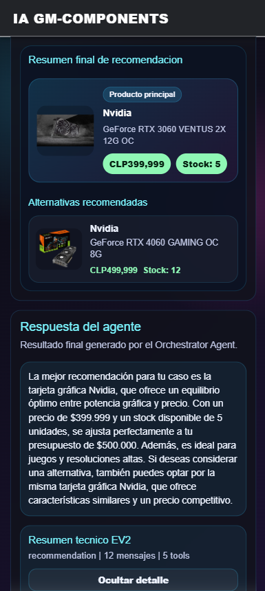

## 6. Memoria de corto y largo plazo

Memoria corta implementada:

- `SessionStore` mantiene mensajes recientes por `session_id`.
- `RecommendationSession` conserva etapa, presupuesto, estado y continuidad del flujo.

Memoria larga implementada:

- `LongTermMemory` persiste hechos en JSON local.
- El archivo se genera en `agente/logs/long_term_store.json`.
- FAQ Agent y Recommendation Agent guardan hechos.
- El frontend muestra coincidencias recuperadas y el hecho guardado.

Evidencia:

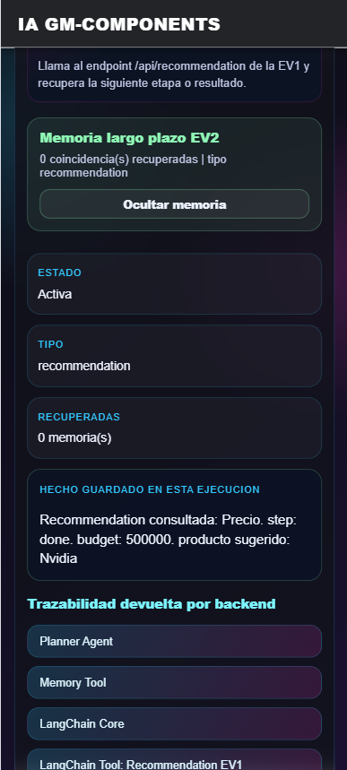

## 7. Consola de agentes EV2

Script usado:

```text
iniciar_consola_agentes_ev2.bat
```

Resultado observado:

- El script levanta `groq-proxy`.
- Se ejecuta la consola EV2.
- La consola muestra intent, tools, memoria y respuesta.
- Sirve como respaldo tecnico de la capa de agentes.

Evidencia:

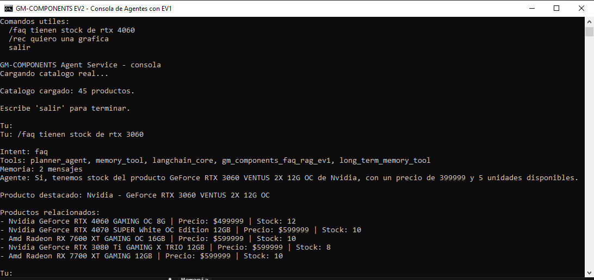
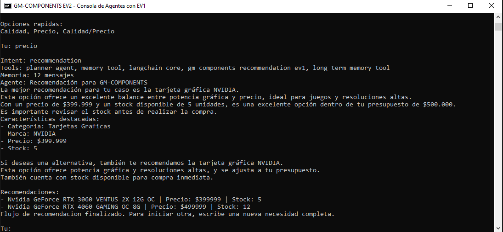

## 8. Validacion TypeScript

Comando:

```powershell
npx.cmd tsc --noEmit -p tsconfig.app.json
```

Resultado:

```text
Sin errores.
```

Evidencia:

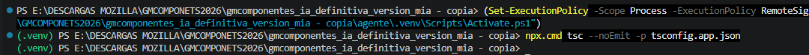

## 9. Validacion LangChain Tools

Comando:

```powershell
.\.venv\Scripts\python.exe -B -c "from tools.langchain_tool_registry import get_langchain_tool_names; print(get_langchain_tool_names())"
```

Resultado esperado:

```text
['gm_components_faq_rag_ev1', 'gm_components_recommendation_ev1', 'gm_components_catalog_search']
```

Evidencia:

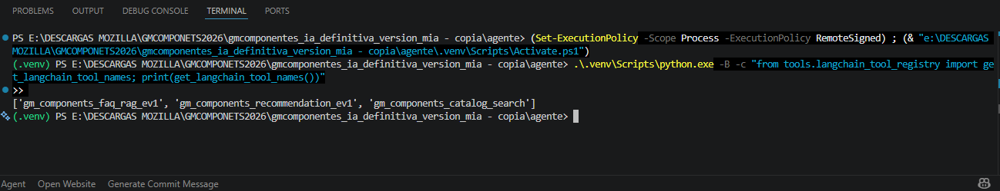

## 10. Relacion con indicadores

| Indicador | Evidencia presentada                                                                         |
| --------- | -------------------------------------------------------------------------------------------- |
| IL2.1     | Agentes funcionales, LangChain StructuredTool, FAQ Agent, Recommendation Agent, tools EV1    |
| IL2.2     | SessionStore, RecommendationSession, LongTermMemory, memoria largo plazo visible en frontend |
| IL2.3     | Planner Agent, Orchestrator Agent, flujo Recommendation por etapas y decisiones adaptativas  |
| IL2.4     | Documentacion tecnica y evidencias en `agente/docs`                                          |
