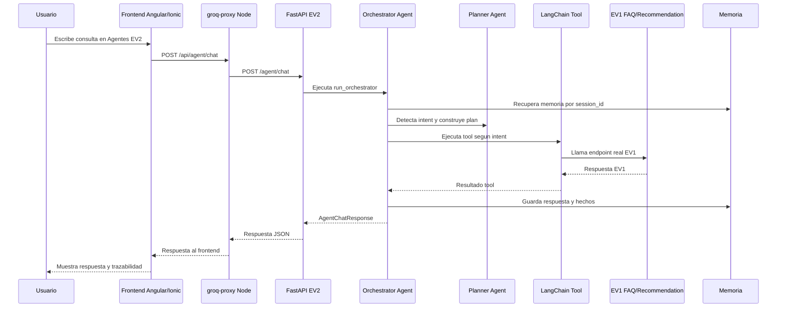

# Flujos EV2 - GM-COMPONENTS

## 1. Objetivo del documento

Este documento describe los flujos principales de la capa EV2 de agentes.

La EV2 agrega agentes sobre la EV1 sin reemplazar sus componentes principales. Los agentes coordinan el trabajo, planifican, usan memoria y ejecutan tools reales conectadas a los endpoints existentes de EV1.

## 2. Flujo general de agentes



## 3. Flujo FAQ Agent

### 3.1 Entrada esperada

El flujo FAQ se usa para preguntas sobre:

- tienda,
- productos,
- stock,
- garantia,
- despacho,
- catalogo general,
- modelos especificos como RTX, Ryzen, DDR, etc.

Ejemplos:

```text
tienen stock de rtx 4060
quiero una rtx 3060
muestrame graficas nvidia
que venden
tienen garantia
hacen despacho
```

El frontend fuerza este flujo agregando el prefijo:

```text
/faq
```

Ejemplo enviado al backend:

```text
/faq tienen stock de rtx 4060
```

### 3.2 Pasos internos

1. `Orchestrator Agent` recibe el mensaje.
2. Detecta el comando `/faq` o clasifica la intencion como `faq`.
3. Guarda el mensaje del usuario en memoria corta.
4. `Planner Agent` genera el plan:

```text
analizar_consulta
normalizar_pregunta
recuperar_contexto_ev1
responder_con_evidencia
```

5. `FAQ Agent` busca coincidencias en memoria larga.
6. `FAQ Agent` ejecuta la tool LangChain:

```text
gm_components_faq_rag_ev1
```

7. La tool llama a EV1:

```text
POST /api/faq
```

8. EV1 ejecuta el RAG FAQ existente.
9. El agente guarda un hecho en memoria larga.
10. La respuesta vuelve al frontend con trazabilidad.

### 3.3 Salida esperada

La respuesta incluye:

- respuesta del agente,
- intent `faq`,
- tools usadas,
- plan,
- producto destacado,
- productos relacionados,
- memoria corta,
- memoria larga,
- framework LangChain.

Ejemplo de tools:

```text
planner_agent
memory_tool
langchain_core
gm_components_faq_rag_ev1
long_term_memory_tool
```

## 4. Flujo Recommendation Agent

## 4.1 Entrada esperada

El flujo Recommendation se usa cuando el usuario solicita una recomendacion de componente.

Ejemplos:

```text
quiero una grafica
recomiendame una grafica para gaming
tengo 500000 para una tarjeta de video
```

El frontend fuerza este flujo agregando el prefijo:

```text
/rec
```

Ejemplo enviado al backend:

```text
/rec quiero una grafica
```

## 4.2 Flujo conversacional por etapas

El flujo recomendado para prueba es:

```text
quiero una grafica
500000
Sin preferencia
Gaming
Precio
```

Etapas visuales del frontend:

```text
Necesidad
Presupuesto
Componente
Marca
Uso
Prioridad
Resultado
```

La etapa `Presupuesto` es visual en frontend. El backend EV1 puede devolver `nextStep: initial` cuando falta presupuesto, pero la interfaz lo representa como una etapa separada para que el flujo sea comprensible.

## 4.3 Pasos internos

1. `Orchestrator Agent` recibe el mensaje.
2. Detecta `/rec` o clasifica la intencion como `recommendation`.
3. Si ya existe una recomendacion activa, fuerza continuidad del flujo.
4. `Planner Agent` genera el plan:

```text
analizar_consulta
revisar_memoria
consultar_recomendador
redactar_respuesta
```

5. `Recommendation Agent` revisa memoria corta.
6. Extrae presupuesto si viene en el mensaje.
7. Si el usuario envia solo presupuesto, reutiliza `baseRequest`.
8. Recupera coincidencias de memoria larga.
9. Ejecuta la tool LangChain:

```text
gm_components_recommendation_ev1
```

10. La tool llama a EV1:

```text
POST /api/recommendation
```

11. EV1 responde con:

- `mode`,
- `nextStep`,
- `quickOptions`,
- `state`,
- `suggestions`.

12. `Recommendation Agent` actualiza memoria corta.
13. Guarda un hecho en memoria larga.
14. Si el flujo termina con `nextStep: done` y `mode: result`, limpia la recomendacion activa.
15. El frontend muestra resultado, alternativas y trazabilidad.

## 4.4 Salida esperada

La respuesta incluye:

- respuesta final o siguiente pregunta,
- etapa siguiente,
- opciones rapidas,
- productos sugeridos,
- memoria corta,
- memoria larga,
- tools usadas,
- plan,
- framework LangChain.

Ejemplo de tools:

```text
planner_agent
memory_tool
langchain_core
gm_components_recommendation_ev1
long_term_memory_tool
```

## 5. Flujo de memoria

## 5.1 Memoria corta

La memoria corta vive en:

```text
agente/memory/session_store.py
```

Se usa para:

- registrar mensajes usuario/agente,
- contar turnos,
- mantener el estado de recomendacion,
- recordar presupuesto,
- recordar etapa,
- mantener continuidad por `session_id`.

Ejemplo de estado de recomendacion:

```text
step: brand
budget: 500000
active: true
state: {...}
```

## 5.2 Memoria larga

La memoria larga vive en:

```text
agente/memory/long_term_memory.py
```

Persiste hechos en:

```text
agente/logs/long_term_store.json
```

Este archivo se ignora en Git porque es dato local de ejecucion.

FAQ Agent guarda hechos como:

```text
FAQ consultada: tienen stock de rtx 4060. Producto destacado: RTX 4060
```

Recommendation Agent guarda hechos como:

```text
Recommendation consultada: quiero una grafica. step: priority. budget: 500000
```

El frontend muestra la memoria larga en:

```text
Resumen tecnico EV2 -> Ver trazabilidad completa -> Memoria largo plazo EV2
```

## 6. Flujo LangChain

La capa EV2 usa LangChain Core para registrar tools tipadas mediante `StructuredTool`.

Archivo:

```text
agente/tools/langchain_tool_registry.py
```

Tools registradas:

```text
gm_components_faq_rag_ev1
gm_components_recommendation_ev1
gm_components_catalog_search
```

El flujo es:

```text
Agente especializado
  -> invoke_langchain_tool
  -> StructuredTool
  -> funcion Python
  -> endpoint EV1 o busqueda de catalogo
```

Esto permite evidenciar el uso de un framework especifico de agentes sin reescribir RAG ni Recommendation.

## 7. Flujo consola EV2

La consola se ejecuta con:

```text
iniciar_consola_agentes_ev2.bat
```

Este script:

1. Levanta `groq-proxy`.
2. Ejecuta `agente/main.py`.
3. Permite probar `/faq` y `/rec`.
4. Muestra en CMD:

- intent,
- tools usadas,
- memoria,
- respuesta,
- productos relacionados,
- recomendaciones,
- opciones rapidas.

Ejemplos:

```text
/faq tienen stock de rtx 4060
```

```text
/rec quiero una grafica
500000
Sin preferencia
Gaming
Precio
```

## 8. Flujo de ejecucion completa

Para levantar todo el proyecto se usa:

```text
iniciar_proyecto_completo_ev2.bat
```

Este script abre los servicios principales:

```text
EV1 groq-proxy        http://localhost:8787
EV2 FastAPI agentes  http://localhost:8790
Frontend Angular
```

Tambien se puede levantar manualmente:

```powershell
cd groq-proxy
npm.cmd start
```

```powershell
cd agente
.\.venv\Scripts\python.exe -m uvicorn app:app --host 127.0.0.1 --port 8790
```

```powershell
npm.cmd start
```

## 9. Casos de prueba sugeridos

### 9.1 FAQ Agent

```text
tienen stock de rtx 4060
```

Resultado esperado:

- intent `faq`,
- tool LangChain FAQ/RAG EV1,
- respuesta desde EV1,
- trazabilidad de planner,
- memoria larga guardada.

### 9.2 Recommendation Agent

```text
quiero una grafica
500000
Sin preferencia
Gaming
Precio
```

Resultado esperado:

- flujo por etapas,
- memoria corta activa,
- memoria larga guardada,
- producto principal,
- alternativas recomendadas,
- plan del Planner Agent.

### 9.3 Validacion de LangChain

Comando:

```powershell
cd agente
.\.venv\Scripts\python.exe -B -c "from tools.langchain_tool_registry import get_langchain_tool_names; print(get_langchain_tool_names())"
```

Resultado esperado:

```text
['gm_components_faq_rag_ev1', 'gm_components_recommendation_ev1', 'gm_components_catalog_search']
```

## 10. Relacion con indicadores

| Indicador | Flujo relacionado |
|---|---|
| IL2.1 | FAQ Agent y Recommendation Agent ejecutando LangChain Tools conectadas a EV1 |
| IL2.2 | Memoria corta por session_id y memoria larga persistida en JSON |
| IL2.3 | Planner Agent y flujo de Recommendation por etapas |
| IL2.4 | Documentacion de arquitectura, flujos y evidencias |
